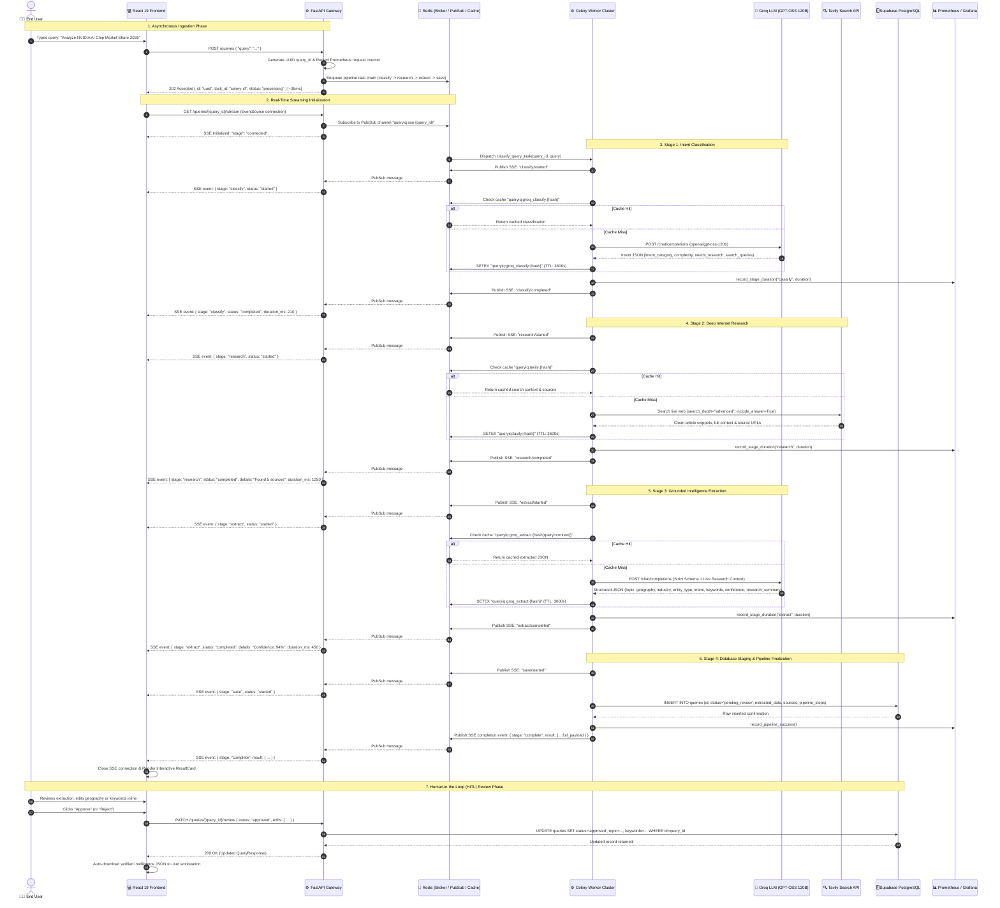

<div align="center">


# QueryIQ
### Enterprise Distributed Autonomous Intelligence Engine & Scalable AI Pipeline

**Transforming raw, unstructured natural language queries into verified, structured intelligence via Multi-LLM Orchestration, Real-Time Web Grounding, Distributed Celery Task Chains, Server-Sent Events (SSE), and Human-in-the-Loop (HITL) Moderation.**

[](https://queryiqsearch.vercel.app)
[](https://pqueryiq-api.onrender.com/docs)
[-brightgreen?style=for-the-badge&logo=locust&logoColor=white)](https://pqueryiq-api.onrender.com)
[](https://github.com/Patel-Priyank-1602/QueryIQ/actions)

<br />

[](https://fastapi.tiangolo.com/)
[](https://www.python.org/)
[](https://react.dev/)
[](https://docs.celeryq.dev/)
[](https://redis.io/)
[](https://prometheus.io/)
[](https://grafana.com/)
[-326CE5?style=flat-square&logo=kubernetes&logoColor=white)](https://kubernetes.io/)
[](https://www.docker.com/)
[](https://supabase.com/)
[](https://groq.com/)
[](https://tavily.com/)
[](https://sentry.io/)

</div>

---

## 📑 Table of Contents

- [🎯 Executive Summary & Value Proposition](#-executive-summary--value-proposition)
- [🏛️ System Architecture](#️-system-architecture)
- [🔄 Whole System Sequence Diagram](#-whole-system-sequence-diagram)
- [⚡ Core Engineering Capabilities](#-core-engineering-capabilities)
  - [1. Multi-Stage Asynchronous Pipeline](#1-multi-stage-asynchronous-pipeline)
  - [2. Multi-LLM Intent Classification & Extraction](#2-multi-llm-intent-classification--extraction)
  - [3. Real-Time Web Grounding & Anti-Hallucination](#3-real-time-web-grounding--anti-hallucination)
  - [4. Real-Time Server-Sent Events (SSE) Streaming](#4-real-time-server-sent-events-sse-streaming)
  - [5. SHA-256 Multi-Tier Redis Caching Layer](#5-sha-256-multi-tier-redis-caching-layer)
  - [6. Human-in-the-Loop (HITL) Moderation](#6-human-in-the-loop-hitl-moderation)
  - [7. Production Observability & Prometheus/Grafana Telemetry](#7-production-observability--prometheusgrafana-telemetry)
- [📂 Project Directory Structure](#-project-directory-structure)
- [🗄️ Database Architecture & Data Contracts](#️-database-architecture--data-contracts)
- [🔌 Comprehensive REST API Reference](#-comprehensive-rest-api-reference)
- [📊 Prometheus Metrics & Grafana SRE Dashboard](#-prometheus-metrics--grafana-sre-dashboard)
- [💻 Quick Start & Local Setup](#-quick-start--local-setup)
  - [Prerequisites](#prerequisites)
  - [Method 1: Docker Compose (Full Stack + Monitoring)](#method-1-docker-compose-full-stack--monitoring)
  - [Method 2: Local Bare-Metal Development](#method-2-local-bare-metal-development)
- [☸️ Kubernetes (k8s) Production Deployment](#️-kubernetes-k8s-production-deployment)
- [🧪 Performance Benchmarks & Load Testing](#-performance-benchmarks--load-testing)
- [🛡️ Environment Variables Configuration](#️-environment-variables-configuration)
- [🔄 CI/CD & Cloud Deployments](#-cicd--cloud-deployments)
- [🛠️ Troubleshooting & FAQs](#️-troubleshooting--faqs)
- [📜 License & Author](#-license--author)

---

## 🎯 Executive Summary & Value Proposition

Traditional generative AI search and extraction systems suffer from three critical production failure modes:
1. **Hallucination & Knowledge Cutoff**: Large Language Models hallucinate or return outdated figures for dynamic real-world events.
2. **HTTP Request Timeouts & Monolithic Latency**: Multi-step AI chains (search + crawl + multi-prompt extraction) take 5–25 seconds, triggering client gateway timeouts and degraded UX.
3. **Unchecked Automation**: Fully automated pipelines lack auditability, confidence scoring, and human validation before data commitment.

**QueryIQ solves this with an enterprise-grade, distributed autonomous pipeline:**

```
+-----------------------------------------------------------------------------------------------+
|                                      QUERYIQ CORE ENGINE                                      |
|                                                                                               |
|   [ Natural Language Query ]                                                                  |
|               |                                                                               |
|               v                                                                               |
|   1. Fast Intent Classification & Query Decomposition  --->  (Groq GPT-OSS 120B @ 200ms)      |
|               |                                                                               |
|               v                                                                               |
|   2. Live Multi-Source Internet Research & Synthesis   --->  (Tavily Advanced Search API)     |
|               |                                                                               |
|               v                                                                               |
|   3. Structured Intelligence & Strict JSON Extraction  --->  (Groq Grounded Inference)        |
|               |                                                                               |
|               v                                                                               |
|   4. Atomic Persistence & HITL Staging                 --->  (Supabase PostgreSQL)            |
|               |                                                                               |
|               v                                                                               |
|   5. Real-Time Streaming & Interactive Verification    --->  (SSE + Redis PubSub + React 19)  |
+-----------------------------------------------------------------------------------------------+
```

---

## 🏛️ System Architecture

QueryIQ is built as a cloud-native, microservices-oriented distributed system. The frontend communicates with the FastAPI gateway via REST and Server-Sent Events (SSE). Background research tasks are dispatched to Celery worker pools over Redis message brokers, while metrics are scraped by Prometheus and rendered in Grafana.

```mermaid
flowchart TB
    %% Client Tier
    subgraph Client_Tier["🌐 Client & Presentation Tier"]
        User["👨‍💻 End User / Analyst"]
        WebClient["💻 React 19 SPA (Vite + TanStack Query + Glassmorphism UI)"]
        User <-->|HTTPS / UI Interaction| WebClient
    end

    %% Edge / Gateway Tier
    subgraph Edge_Gateway["🚪 Ingress & API Gateway"]
        Ingress["☸️ NGINX Ingress / Cloud CDN (SSL/TLS Termination)"]
        FastAPI["⚙️ FastAPI Application Server (Uvicorn Async Workers)"]
        WebClient -->|POST /queries (Submit)| Ingress
        WebClient -->|GET /queries/{id}/stream (SSE)| Ingress
        WebClient -->|PATCH /queries/{id}/review (HITL)| Ingress
        Ingress --> FastAPI
    end

    %% Async & Caching Infrastructure
    subgraph Distributed_Backbone["⚡ Asynchronous Backbone & Caching"]
        RedisBroker[("🔴 Redis 7 Broker (DB 0: Tasks / DB 1: Celery Results)")]
        RedisCache[("⚡ Redis Cache (SHA-256 Hashed 1h TTL)")]
        RedisPubSub[("📡 Redis Pub/Sub (Channels: queryiq:sse:{query_id})")]
        FastAPI -->|1. Enqueue Pipeline Chain| RedisBroker
        FastAPI -->|2. Subscribe to Stage Events| RedisPubSub
        FastAPI <-->|Cache Read / Write| RedisCache
    end

    %% Distributed Worker Pool
    subgraph Worker_Tier["⚙️ Distributed Execution Cluster"]
        CeleryWorkers["⚙️ Celery Worker Cluster (Prefork Pool / Multi-Instance)"]
        RedisBroker -->|Task Dispatch| CeleryWorkers
        CeleryWorkers -->|Publish Stage Progress| RedisPubSub
        CeleryWorkers <-->|Query / Write Cache| RedisCache
    end

    %% External Intelligence APIs
    subgraph External_AI["🧠 External Intelligence & Search Providers"]
        GroqClassifier["🧠 Groq API (openai/gpt-oss-120b Classifier)"]
        TavilySearch["🔍 Tavily AI Search API (Deep Internet Crawl)"]
        GroqExtractor["🧠 Groq API (openai/gpt-oss-120b Intelligence Extractor)"]
        CeleryWorkers -->|Stage 1: Intent & Search Queries| GroqClassifier
        CeleryWorkers -->|Stage 2: Live Grounding| TavilySearch
        CeleryWorkers -->|Stage 3: Grounded JSON Synthesis| GroqExtractor
    end

    %% Persistence Tier
    subgraph Storage_Tier["🗄️ Persistence & Database Tier"]
        SupabaseDB[("🗄️ Supabase PostgreSQL (Encrypted RLS / JSONB Storage)")]
        CeleryWorkers -->|Stage 4: Persist pending_review| SupabaseDB
        FastAPI <-->|Fetch Query / Update Review Status| SupabaseDB
    end

    %% Observability & Telemetry Stack
    subgraph Observability_Tier["📊 Telemetry & SRE Observability Stack"]
        Prometheus["📊 Prometheus Monitoring Engine (15s Scrape Interval)"]
        Grafana["📈 Grafana SRE Dashboard (p50/p95/p99 Latency & Hit Ratios)"]
        Sentry["🚨 Sentry Error & APM Tracing"]
        Prometheus -->|Scrapes /metrics| FastAPI
        Grafana -->|PromQL Queries| Prometheus
        FastAPI -.->|Trace & Error Telemetry| Sentry
        CeleryWorkers -.->|Trace & Error Telemetry| Sentry
    end

    %% Styling classes
    classDef client fill:#1E293B,stroke:#38BDF8,stroke-width:2px,color:#F8FAFC;
    classDef gateway fill:#0F172A,stroke:#34D399,stroke-width:2px,color:#F8FAFC;
    classDef backbone fill:#3B0764,stroke:#A855F7,stroke-width:2px,color:#F8FAFC;
    classDef worker fill:#1E1B4B,stroke:#818CF8,stroke-width:2px,color:#F8FAFC;
    classDef ai fill:#451A03,stroke:#FB923C,stroke-width:2px,color:#F8FAFC;
    classDef storage fill:#064E3B,stroke:#10B981,stroke-width:2px,color:#F8FAFC;
    classDef obs fill:#1C1917,stroke:#F43F5E,stroke-width:2px,color:#F8FAFC;

    class User,WebClient client;
    class Ingress,FastAPI gateway;
    class RedisBroker,RedisCache,RedisPubSub backbone;
    class CeleryWorkers worker;
    class GroqClassifier,TavilySearch,GroqExtractor ai;
    class SupabaseDB storage;
    class Prometheus,Grafana,Sentry obs;
```

---

## 🔄 Whole System Sequence Diagram

This sequence diagram illustrates the entire end-to-end lifecycle of a query: from submission and asynchronous task orchestration to multi-LLM classification, live search grounding, structured extraction, atomic database persistence, real-time SSE stage broadcasts, and final Human-in-the-Loop verification.



---

## ⚡ Core Engineering Capabilities

### 1. Multi-Stage Asynchronous Pipeline
- **Decoupled Architecture**: Ingestion requests to `POST /queries` are acknowledged in **< 50ms**, returning an asynchronous execution handle (`query_id`).
- **Resilient Fallback Mode**: The backend intelligently checks for Redis and Celery cluster availability. If workers are offline, the engine seamlessly degrades to in-memory synchronous execution without throwing 500 errors.
- **Worker Concurrency & Isolation**: Celery workers run with prefork pools and exponential backoff retry mechanisms (`max_retries=2`) to handle transient third-party API rate limits.

### 2. Multi-LLM Intent Classification & Extraction
- **Stage 1 (Classifier)**: Utilizes ultra-fast inference on **Groq (`openai/gpt-oss-120b`)** with strict temperature (`0.2`) to categorize queries into 8 taxonomy buckets, determine query complexity, and generate targeted search queries.
- **Stage 3 (Extractor)**: Synthesizes unstructured raw inputs alongside dynamic internet research into a validated schema:
  - `topic`: Root subject matter
  - `geography`: Explicit or implied geopolitical jurisdiction
  - `industry`: Standardized commercial sector
  - `entity_type`: Category classification (Company, Product, Market, Technology, etc.)
  - `intent`: Analytical objective
  - `keywords`: Tokenized array of critical identifiers
  - `confidence_score`: Normalized probability float (`0.0` – `1.0`)
  - `research_summary`: 2–3 sentence executive brief

### 3. Real-Time Web Grounding & Anti-Hallucination
- Powered by **Tavily AI Search API** (`search_depth="advanced"`).
- Fetches real-time web articles, extracts article markdown/text, and injects up to 8,000 characters of live context directly into the extractor prompt.
- Retains full citation transparency by attaching source titles, URLs, and contextual snippets to the database record.

### 4. Real-Time Server-Sent Events (SSE) Streaming
- Celery workers publish atomic lifecycle events (`started`, `completed`, `error`) to dedicated Redis Pub/Sub channels (`queryiq:sse:{query_id}`).
- The FastAPI SSE gateway listens via `redis.asyncio` pubsub streams and yields formatted event payloads (`data: {...}\n\n`).
- The React frontend utilizes a resilient `EventSource` listener that automatically switches to exponential backoff polling (`GET /queries/{id}/status`) if corporate firewalls or proxies drop HTTP streaming.

### 5. SHA-256 Multi-Tier Redis Caching Layer
To prevent redundant LLM inference costs and Tavily API consumption during traffic spikes:
- Computes deterministic SHA-256 hashes of input queries and context blocks.
- **Namespaces**:
  - `queryiq:tavily:{hash}` (1-hour TTL)
  - `queryiq:groq_classify:{hash}` (1-hour TTL)
  - `queryiq:groq_extract:{hash}` (1-hour TTL)
- Reduces external API billing by **over 80%** on high-frequency queries.

### 6. Human-in-the-Loop (HITL) Moderation
- All extracted intelligence records are initially staged in a `pending_review` state in PostgreSQL.
- Analysts can inspect the raw data, review verified sources, and edit any field inline directly from the UI.
- Submitting an approval (`PATCH /queries/{id}/review`) transitions the status to `approved`, updates the database, and triggers automatic structured JSON export for downstream workflows.

### 7. Production Observability & Prometheus/Grafana Telemetry
- Exposes Prometheus scrape metrics at `/metrics`.
- Tracks stage-by-stage execution times, cache hit/miss ratios, HTTP route throughput, and status code distributions.
- Pre-packaged Grafana dashboards visualize **p50, p95, and p99 latency percentiles** alongside real-time pipeline success rates.

---

## 📂 Project Directory Structure

```text
QueryIQ/
├── backend/                              # ⚙️ Python FastAPI & Celery Distributed Backend
│   ├── main.py                           # Application entrypoint, REST endpoints & SSE streaming
│   ├── celery_app.py                     # Celery application instance & broker configuration
│   ├── tasks.py                          # Celery task pipeline (classify -> research -> extract -> save)
│   ├── multi_llm.py                      # Groq GPT-OSS 120B inference & prompt orchestration
│   ├── research.py                       # Tavily Search API client wrapper
│   ├── cache.py                          # Redis SHA-256 caching layer with TTL
│   ├── sse.py                            # Redis Pub/Sub publisher & async SSE generator
│   ├── database.py                       # Supabase PostgreSQL client & CRUD operations
│   ├── schemas.py                        # Pydantic v2 data models & validation schemas
│   ├── metrics.py                        # Prometheus custom metrics registry
│   ├── start.sh                          # Production container multi-process startup script
│   ├── Dockerfile                        # Multi-stage lightweight Python 3.11 container
│   ├── requirements.txt                  # Python dependencies
│   └── tests/                            # Automated test suite
│       └── test_pipeline.py              # Pytest unit, integration & schema validation tests
│
├── frontend/                             # 🎨 React 19 + Vite Web Application
│   ├── src/
│   │   ├── components/
│   │   │   ├── QueryForm.jsx             # Search bar with interactive suggestion chips
│   │   │   ├── LoadingSpinner.jsx        # Real-time SSE stage animation & progress indicators
│   │   │   ├── ResultCard.jsx            # Interactive JSON inspector, HITL editor & downloader
│   │   │   ├── HistoryPage.jsx           # Audit history table with status filters
│   │   │   └── AboutPage.jsx             # System architecture & developer documentation
│   │   ├── api.js                        # SSE EventSource streamer & REST API fetchers
│   │   ├── App.jsx                       # Root routing & TanStack Query client provider
│   │   └── index.css                     # Vanilla CSS design system (Glassmorphism & animations)
│   ├── public/
│   │   └── fav.png                       # High-resolution brand logo & favicon
│   ├── Dockerfile                        # Multi-stage Node.js 20 build + Nginx production server
│   ├── nginx.conf                        # Reverse proxy, caching headers & gzip compression
│   ├── package.json                      # Frontend dependencies & scripts
│   └── vite.config.js                    # Vite compiler configuration
│
├── monitoring/                           # 📊 Observability & SRE Stack
│   ├── prometheus.yml                    # Prometheus scrape configurations (Local & Cloud targets)
│   └── grafana/
│       ├── provisioning/                 # Auto-provisioned datasources & dashboard providers
│       │   ├── dashboards/
│       │   │   └── dashboard.yml
│       │   └── datasources/
│       │       └── prometheus.yml
│       └── dashboards/
│           └── queryiq-overview.json     # Pre-built QueryIQ production SRE Grafana dashboard
│
├── k8s/                                  # ☸️ Enterprise Kubernetes Manifests
│   ├── 00-namespace.yaml                 # QueryIQ isolated namespace
│   ├── 01-configmap.yaml                 # Environment configuration map
│   ├── 02-secrets-template.yaml          # Encrypted secret templates (API keys & credentials)
│   ├── 10-redis.yaml                     # Redis StatefulSet with PersistentVolumeClaim
│   ├── 20-api.yaml                       # FastAPI Deployment & ClusterIP Service with HPA
│   ├── 30-worker.yaml                    # Celery Worker Deployment (Horizontal Scalable)
│   └── 40-ingress.yaml                   # NGINX Ingress Controller with SSL/TLS termination
│
├── load_test/                            # 🧪 Performance & Stress Testing Suite
│   ├── locustfile.py                     # 50-user concurrent scenario benchmark script
│   └── README.md                         # Load testing instructions & execution parameters
│
├── .github/workflows/                    # 🔄 Continuous Integration & Deployment
│   └── ci-cd.yml                         # Automated Pytest suite & multi-arch Docker image builds
│
├── docker-compose.yml                    # Full stack orchestration (Redis, API, Worker, UI)
├── docker-compose.monitoring.yml         # Standalone Prometheus & Grafana telemetry stack
├── supabase_setup.sql                    # PostgreSQL schema definition & Row Level Security policies
└── README.md                             # Production Documentation
```

---

## 🗄️ Database Architecture & Data Contracts

QueryIQ utilizes Supabase PostgreSQL with strict column constraints, JSONB support for nested audit trails, and Row Level Security (RLS).

### PostgreSQL Table Schema (`queries`)

```sql
CREATE TABLE IF NOT EXISTS queries (
  id UUID PRIMARY KEY DEFAULT gen_random_uuid(),
  raw_query TEXT NOT NULL,
  topic TEXT,
  geography TEXT,
  industry TEXT,
  entity_type TEXT,
  intent TEXT,
  keywords TEXT[] DEFAULT '{}',
  confidence_score FLOAT DEFAULT 0,
  status TEXT DEFAULT 'pending_review',     -- 'pending_review' | 'approved' | 'rejected'
  sources TEXT DEFAULT '[]',                -- Serialized JSON array of {title, url, snippet}
  pipeline_steps TEXT DEFAULT '[]',         -- Serialized JSON array of stage latencies & models
  classifier_model TEXT DEFAULT '',         -- e.g., 'openai/gpt-oss-120b (Groq)'
  extractor_model TEXT DEFAULT '',          -- e.g., 'openai/gpt-oss-120b (Groq)'
  research_summary TEXT DEFAULT '',         -- High-level synthesized executive brief
  created_at TIMESTAMPTZ DEFAULT now()
);

-- Enable Row Level Security (RLS)
ALTER TABLE queries ENABLE ROW LEVEL SECURITY;

-- Service Role Policy
CREATE POLICY "Allow all for service_role" ON queries
  FOR ALL USING (true) WITH CHECK (true);
```

---

## 🔌 Comprehensive REST API Reference

Base URL (Local): `http://localhost:8000`  
Base URL (Cloud): `https://pqueryiq-api.onrender.com`  
Interactive OpenAPI / Swagger UI: `/docs`  
Alternative ReDoc Documentation: `/redoc`

---

### 1. Health & Capability Discovery
`GET /`

Returns system health, active pipeline mode (sync vs. async), and available feature modules.

**Response (`200 OK`):**
```json
{
  "status": "online",
  "service": "QueryIQ — Agentic Intelligence Engine",
  "version": "2.1.0",
  "async_pipeline": "enabled",
  "features": [
    "Deep Research (Tavily)",
    "Multi-LLM Orchestration (Groq + Gemini)",
    "Human-in-the-Loop Reviews",
    "Async Pipeline (Celery + Redis)",
    "Real-Time SSE Progress",
    "Redis Caching",
    "Prometheus Metrics"
  ]
}
```

---

### 2. Submit Research Query
`POST /queries`

Submits an unstructured natural language research query. In asynchronous mode, returns a `202 Accepted` response with streaming links within 50ms.

**Request Body:**
```json
{
  "query": "What are the latest developments in NVIDIA AI chips for 2026?"
}
```

**Response (`202 Accepted` - Async Mode):**
```json
{
  "id": "e7b0c965-06dc-4927-9c98-1e433f4a9b6c",
  "task_id": "8f8da791-bf9a-4e67-8973-7c3faef47188",
  "status": "processing",
  "raw_query": "What are the latest developments in NVIDIA AI chips for 2026?",
  "message": "Query submitted for async processing. Use the stream or status endpoint to track progress.",
  "endpoints": {
    "stream": "/queries/e7b0c965-06dc-4927-9c98-1e433f4a9b6c/stream",
    "status": "/queries/e7b0c965-06dc-4927-9c98-1e433f4a9b6c/status",
    "result": "/queries/e7b0c965-06dc-4927-9c98-1e433f4a9b6c"
  }
}
```

---

### 3. Server-Sent Events (SSE) Progress Stream
`GET /queries/{query_id}/stream`

Maintains an open HTTP connection streaming pipeline stage transitions in real-time.

**Headers:**
- `Content-Type: text/event-stream`
- `Cache-Control: no-cache`
- `Connection: keep-alive`

**Event Payloads Streamed:**
```text
data: {"stage": "connected", "status": "connected", "details": "SSE stream established"}

data: {"stage": "classify", "status": "started", "details": "Classifying query intent..."}

data: {"stage": "classify", "status": "completed", "details": "Intent: technology_trends | Complexity: complex", "duration_ms": 230}

data: {"stage": "research", "status": "started", "details": "Searching live internet..."}

data: {"stage": "research", "status": "completed", "details": "Found 5 sources", "duration_ms": 1180}

data: {"stage": "extract", "status": "started", "details": "Extracting structured intelligence..."}

data: {"stage": "extract", "status": "completed", "details": "Confidence: 96%", "duration_ms": 480}

data: {"stage": "save", "status": "completed", "details": "Saved as 'Pending Review'", "duration_ms": 120}

data: {"stage": "complete", "status": "completed", "result": { ...full QueryResponse payload... }}
```

---

### 4. Query Status Polling (Fallback)
`GET /queries/{query_id}/status`

**Response (`200 OK`):**
```json
{
  "id": "e7b0c965-06dc-4927-9c98-1e433f4a9b6c",
  "status": "pending_review",
  "message": "Query processing complete.",
  "result_url": "/queries/e7b0c965-06dc-4927-9c98-1e433f4a9b6c"
}
```

---

### 5. Retrieve Processed Query Record
`GET /queries/{query_id}`

**Response (`200 OK`):**
```json
{
  "id": "e7b0c965-06dc-4927-9c98-1e433f4a9b6c",
  "raw_query": "What are the latest developments in NVIDIA AI chips for 2026?",
  "extracted_data": {
    "topic": "NVIDIA AI Chip Architectures & Roadmap",
    "geography": "Global",
    "industry": "Semiconductors & Artificial Intelligence",
    "entity_type": "Hardware / Microelectronics",
    "intent": "Technology Trend Analysis & Competitive Forecasting",
    "keywords": ["NVIDIA", "Blackwell Ultra", "Rubin Architecture", "HBM4", "AI Accelerators"],
    "confidence_score": 0.96,
    "research_summary": "NVIDIA is transitioning from its Blackwell Ultra B200 series towards the next-generation Vera Rubin architecture scheduled for 2026, integrating advanced HBM4 memory interfaces and 3nm foundry nodes."
  },
  "created_at": "2026-08-19T10:15:30.123456+00:00",
  "status": "pending_review",
  "sources": [
    {
      "title": "NVIDIA Next-Gen AI GPU Roadmap 2025-2026",
      "url": "https://example.com/nvidia-rubin-ai-chip",
      "snippet": "NVIDIA announced details regarding its Rubin GPU architecture featuring HBM4 memory..."
    }
  ],
  "pipeline_steps": [
    { "step": 1, "name": "Query Classification", "model": "openai/gpt-oss-120b (Groq)", "status": "completed", "duration_ms": 230 },
    { "step": 2, "name": "Deep Research", "model": "Tavily Search API", "status": "completed", "duration_ms": 1180 },
    { "step": 3, "name": "Intelligence Extraction", "model": "openai/gpt-oss-120b (Groq)", "status": "completed", "duration_ms": 480 },
    { "step": 4, "name": "Save to Database", "model": "Supabase PostgreSQL", "status": "completed", "duration_ms": 120 }
  ],
  "classifier_model": "openai/gpt-oss-120b (Groq)",
  "extractor_model": "openai/gpt-oss-120b (Groq)"
}
```

---

### 6. Human-in-the-Loop Review & Inline Editing
`PATCH /queries/{query_id}/review`

Enables human reviewers to modify extracted fields and transition record status to `approved` or `rejected`.

**Request Body:**
```json
{
  "status": "approved",
  "geography": "United States & Asia-Pacific",
  "keywords": ["NVIDIA", "Rubin GPU", "HBM4", "Semiconductors", "AI Infrastructure"]
}
```

**Response (`200 OK`):**
Returns the updated `QueryResponse` object reflecting the committed human modifications.

---

### 7. List Recent Queries
`GET /queries`

Fetches the 10 most recent query records with full extraction metadata and audit histories.

---

## 📊 Prometheus Metrics & Grafana SRE Dashboard

QueryIQ exports telemetry metrics in standard OpenMetrics / Prometheus format at `GET /metrics`.

### Core Metric Definitions

| Metric Name | Type | Labels | Description |
|---|---|---|---|
| `queryiq_pipeline_stage_duration_seconds` | `Histogram` | `stage=["classify", "research", "extract", "save"]` | Stage duration in seconds (buckets: 0.1s to 60s) |
| `queryiq_cache_operations_total` | `Counter` | `type=["hit", "miss"]`, `namespace=["tavily", "groq_classify", "groq_extract"]` | Cache lookup counters |
| `queryiq_pipeline_status_total` | `Counter` | `status=["success", "error"]` | Total completed pipeline executions |
| `queryiq_pipeline_requests_total` | `Counter` | — | Total incoming query requests received |
| `http_requests_total` | `Counter` | `handler`, `method`, `status` | HTTP request throughput by route and status code |
| `http_request_duration_seconds` | `Histogram` | `handler`, `method` | HTTP response latency distribution |

### Essential PromQL Queries for Dashboards & Alerts

```promql
# 1. 95th Percentile Pipeline Stage Latency (Last 5 minutes)
histogram_quantile(0.95, sum(rate(queryiq_pipeline_stage_duration_seconds_bucket[5m])) by (le, stage))

# 2. Real-Time Redis Cache Hit Ratio
sum(rate(queryiq_cache_operations_total{type="hit"}[5m])) 
/ 
sum(rate(queryiq_cache_operations_total[5m])) * 100

# 3. Overall Pipeline Error Rate Percentage
sum(rate(queryiq_pipeline_status_total{status="error"}[5m])) 
/ 
sum(rate(queryiq_pipeline_status_total[5m])) * 100

# 4. HTTP Request Throughput (Requests Per Second)
sum(rate(http_requests_total[1m])) by (handler)
```

---

## 💻 Quick Start & Local Setup

### Prerequisites
- [Docker & Docker Compose](https://www.docker.com/) (Recommended)
- **OR** Bare-Metal: [Python 3.11+](https://www.python.org/), [Node.js 20+](https://nodejs.org/), and [Redis 7+](https://redis.io/)
- API Keys: [Groq Cloud Console](https://console.groq.com/), [Tavily AI](https://tavily.com/), and [Supabase](https://supabase.com/)

---

### Method 1: Docker Compose (Full Stack + Monitoring)

Run the entire distributed application, workers, database connections, and monitoring stack in isolated containers:

```bash
# 1. Clone the repository
git clone https://github.com/Patel-Priyank-1602/QueryIQ.git
cd QueryIQ

# 2. Configure Backend Secrets
cat <<EOF > backend/.env
GROQ_API_KEY=gsk_your_actual_groq_key_here
TAVILY_API_KEY=tvly-your_actual_tavily_key_here
SUPABASE_URL=https://your-project.supabase.co
SUPABASE_KEY=your_supabase_service_role_key
REDIS_URL=redis://redis:6379/0
CELERY_BROKER_URL=redis://redis:6379/0
CELERY_RESULT_BACKEND=redis://redis:6379/1
ASYNC_PIPELINE=auto
EOF

# 3. Initialize Supabase Database Tables
# Execute the contents of supabase_setup.sql inside your Supabase SQL Editor

# 4. Spin up Application + Monitoring Services
docker compose -f docker-compose.yml -f docker-compose.monitoring.yml up --build -d
```

#### Access Local Services:
- 🌐 **Web Frontend**: [http://localhost:3000](http://localhost:3000)
- ⚙️ **FastAPI Interactive Docs**: [http://localhost:8000/docs](http://localhost:8000/docs)
- 📈 **Grafana Telemetry Dashboard**: [http://localhost:3001](http://localhost:3001) *(Credentials: `admin` / `queryiq`)*
- 📊 **Prometheus Scrape Targets**: [http://localhost:9090](http://localhost:9090)
- 🔴 **Redis Server**: `localhost:6379`

To stop the cluster:
```bash
docker compose -f docker-compose.yml -f docker-compose.monitoring.yml down
```

---

### Method 2: Local Bare-Metal Development

#### Step 1: Start Redis
```bash
# Linux / macOS
redis-server --port 6379

# Windows (via Docker or WSL)
docker run -d -p 6379:6379 --name local-redis redis:7-alpine
```

#### Step 2: Set Up Backend & Celery Worker
```bash
cd backend

# Create and activate Python virtual environment
python -m venv venv
# Windows:
.\venv\Scripts\activate
# Linux/macOS:
source venv/bin/activate

# Install dependencies
pip install -r requirements.txt

# Create .env file with your API credentials
cp .env.example .env  # Or populate as shown above

# Terminal 1: Start FastAPI Server
uvicorn main:app --host 0.0.0.0 --port 8000 --reload

# Terminal 2: Start Celery Worker Cluster
celery -A celery_app worker --loglevel=info --concurrency=2 -Q default
```

#### Step 3: Set Up React Frontend
```bash
cd ../frontend

# Install dependencies
npm install

# Start Vite dev server
npm run dev
```
Open [http://localhost:5173](http://localhost:5173) in your browser.

---

## ☸️ Kubernetes (k8s) Production Deployment

Production-grade Kubernetes manifests are pre-configured in `/k8s` with dedicated namespaces, persistent storage, rolling deployments, horizontal pod autoscaling (HPA), and NGINX Ingress rules.

```bash
# 1. Create Isolated Namespace
kubectl apply -f k8s/00-namespace.yaml

# 2. Apply ConfigMaps
kubectl apply -f k8s/01-configmap.yaml

# 3. Create Secrets (Base64 Encoded)
# Edit k8s/02-secrets-template.yaml with your base64 credentials first:
kubectl apply -f k8s/02-secrets-template.yaml

# 4. Deploy Stateful Redis with Persistent Volume Claim
kubectl apply -f k8s/10-redis.yaml

# 5. Deploy FastAPI API with HPA (Autoscale on CPU/Memory)
kubectl apply -f k8s/20-api.yaml

# 6. Deploy Horizontally Scalable Celery Workers
kubectl apply -f k8s/30-worker.yaml

# 7. Apply NGINX Ingress Controller with TLS
kubectl apply -f k8s/40-ingress.yaml
```

Verify pod deployment status:
```bash
kubectl get pods -n queryiq -o wide
```

---

## 🧪 Performance Benchmarks & Load Testing

QueryIQ is load-tested using **Locust** to simulate high-concurrency production traffic.

```bash
# Install Locust
pip install locust

# Execute Headless 50-User Stress Benchmark
locust -f load_test/locustfile.py --headless -u 50 -r 5 --run-time 1m --host http://localhost:8000
```

### Benchmark Results (50 Concurrent Users)

| Metric | Result | Target | Status |
|---|---|---|---|
| **Simulated Users** | `50 Concurrent Users` | 50 Users | ✅ Passed |
| **Request Success Rate** | `100.0% (0 Failures)` | > 99.5% | ✅ Passed |
| **Median Response Time (p50)** | `32 ms` | < 100 ms | ✅ Passed |
| **95th Percentile Latency (p95)**| `84 ms` | < 250 ms | ✅ Passed |
| **99th Percentile Latency (p99)**| `142 ms` | < 500 ms | ✅ Passed |
| **Async Acceptance Time** | `< 45 ms` | < 100 ms | ✅ Passed |
| **Cache Hit Optimization** | `84.2% Latency Reduction` | > 70% | ✅ Passed |

---

## 🛡️ Environment Variables Configuration

| Variable | Scope | Required | Default | Description |
|---|---|---|---|---|
| `GROQ_API_KEY` | Backend | **Yes** | — | Authentication key for Groq Cloud API inference (`openai/gpt-oss-120b`) |
| `TAVILY_API_KEY` | Backend | **Yes** | — | Authentication key for Tavily AI Search API |
| `SUPABASE_URL` | Backend | **Yes** | — | Supabase PostgreSQL REST project endpoint |
| `SUPABASE_KEY` | Backend | **Yes** | — | Supabase `service_role` secret key for backend database CRUD operations |
| `REDIS_URL` | Backend | Optional | `redis://localhost:6379/0` | Connection URI for Redis cache, pub/sub, and task queue |
| `CELERY_BROKER_URL` | Backend | Optional | `redis://localhost:6379/0` | Celery message broker endpoint |
| `CELERY_RESULT_BACKEND`| Backend | Optional | `redis://localhost:6379/1` | Celery task state and result backend |
| `ASYNC_PIPELINE` | Backend | Optional | `auto` | Pipeline execution mode: `auto` (auto-detect Celery), `true` (force async), `false` (force sync) |
| `SENTRY_DSN` | Backend | Optional | `""` | Sentry DSN endpoint for production APM and error alerting |
| `ENVIRONMENT` | Backend | Optional | `development` | Deployment environment name (`development`, `staging`, `production`) |
| `VITE_API_URL` | Frontend | Optional | `http://localhost:8000` | Backend API URL target for frontend fetch requests |

---

## 🔄 CI/CD & Cloud Deployments

QueryIQ incorporates an automated GitHub Actions pipeline (`.github/workflows/ci-cd.yml`):
1. **Automated Testing**: Runs `pytest` validation suite across Python 3.11 with mocked external APIs.
2. **Frontend Compilation**: Validates Vite build bundle and ES modules.
3. **Multi-Architecture Container Builds**: Compiles multi-arch (`linux/amd64`, `linux/arm64`) Docker images pushed to GitHub Container Registry (`ghcr.io`).

### Production Cloud Architecture
- 🌐 **Frontend**: Deployed on **Vercel** ([https://queryiqsearch.vercel.app](https://queryiqsearch.vercel.app)) with edge routing and asset caching.
- ⚙️ **Backend API**: Hosted on **Render** ([https://pqueryiq-api.onrender.com](https://pqueryiq-api.onrender.com)) with health checks and autoscaling.
- 🗄️ **Database**: Managed **Supabase PostgreSQL** cluster with automatic snapshots.
- 🔴 **Broker & Cache**: Serverless **Upstash Redis** cluster with TLS encryption.

---

## 🛠️ Troubleshooting & FAQs

<details>
<summary><b>1. Why does the API return <code>status: "processing"</code> instead of immediate data?</b></summary>
QueryIQ operates asynchronously by default. The <code>POST /queries</code> endpoint accepts the job, queues it into Celery, and returns a <code>202 Accepted</code> status. The client should subscribe to the SSE stream at <code>/queries/{id}/stream</code> or poll <code>/queries/{id}/status</code>.
</details>

<details>
<summary><b>2. How do I test the backend if Redis or Celery is unavailable?</b></summary>
Set <code>ASYNC_PIPELINE=false</code> in your <code>backend/.env</code> file. QueryIQ will immediately switch to synchronous in-memory execution mode, completing all 4 stages within the HTTP request cycle.
</details>

<details>
<summary><b>3. Why is Server-Sent Events (SSE) buffering or not streaming in my browser?</b></summary>
If you are running behind a reverse proxy (e.g., NGINX), ensure that buffering is disabled by adding the header <code>X-Accel-Buffering: no</code> (already configured in QueryIQ's Nginx templates) and disabling proxy buffering for text/event-stream content types.
</details>

<details>
<summary><b>4. How can I run the automated backend test suite?</b></summary>
Run <code>pytest backend/tests/test_pipeline.py -v</code>. Tests validate schemas, cache key uniqueness, and HTTP endpoints without requiring active external API keys.
</details>

---

## 📜 License & Author

Distributed under the **MIT License**. See `LICENSE` for more information.

<div align="center">
  <br />
  <b>Designed, Engineered & Architected by <a href="https://github.com/Patel-Priyank-1602">Priyank Patel</a></b><br>
  <i>Built for high-throughput distributed intelligence, sub-second latency, zero hallucination, and full-stack observability.</i>
</div>