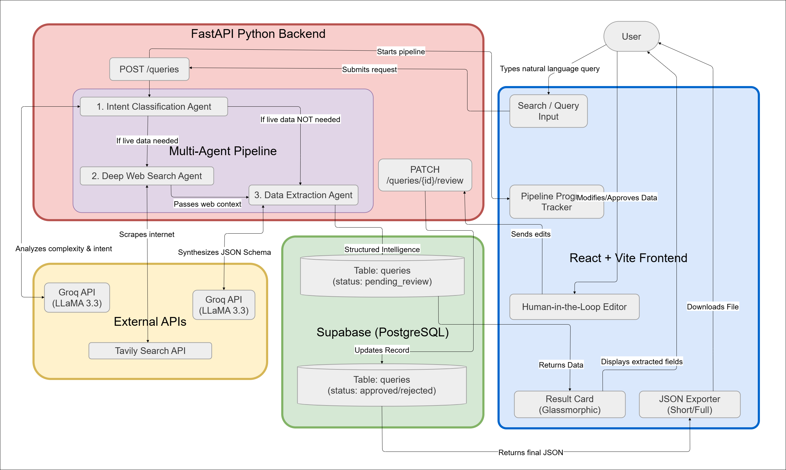
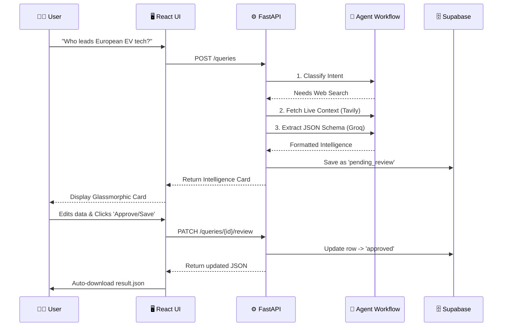

<div align="center">


# QueryIQ
### Production-Grade Agentic Intelligence Engine

**Transforming natural language into structured, actionable data through Multi-LLM Orchestration and Autonomous Web Research.**

[](https://queryiqsearch.netlify.app)

[](https://fastapi.tiangolo.com/)
[](https://react.dev/)
[](https://supabase.com/)
[](https://groq.com/)
[](https://tavily.com/)

<br />
<i>(Click the Live Demo badge above to see it in action)</i>

</div>

---

## 🎯 The Vision
Modern data research is fragmented. **QueryIQ** bridges the gap between unstructured human curiosity and structured database architecture. By employing an **Agentic AI Pipeline**, it dynamically scrapes the internet, synthesizes data via LLaMA 3.3, and strictly formats the output into a consumable JSON schema—all verified through a Human-in-the-Loop (HITL) interface.

This is not a wrapper; it is an **intelligent orchestration engine** built for scale, speed, and accuracy.

---

## ⚡ Core Architecture

QueryIQ is built using a decoupled client-server architecture, emphasizing separation of concerns, high performance, and a seamless user experience.

| 🎨 Frontend (Client) | ⚙️ Backend (API) | 🧠 AI & Infrastructure |
| :--- | :--- | :--- |
| **Framework:** React + Vite | **Framework:** FastAPI (Python) | **Orchestration:** Multi-agent routing |
| **Styling:** Custom Glassmorphism CSS | **Server:** Uvicorn ASGI | **LLM Engine:** Groq (LLaMA 3.3 70B) |
| **State:** React Hooks / Context | **Validation:** Pydantic (Strict typing) | **Web Scraping:** Tavily Search API |
| **UX:** Dynamic Micro-animations | **Integrations:** RESTful Architecture | **Database:** Supabase (PostgreSQL) |

---

## 🤖 The Agentic Pipeline
Unlike traditional chatbots, QueryIQ operates autonomously using a multi-step verification pipeline to prevent hallucinations.

1. **Intent Classification (`Groq`):** Analyzes the raw query to determine complexity, required geography, and whether live web research is necessary.
2. **Deep Web Scraping (`Tavily`):** If required, agents trigger live internet searches, bypassing standard LLM knowledge cut-offs.
3. **Data Synthesis & Extraction (`Groq`):** Contextual data is fed back into the LLM with strict formatting instructions to extract precise JSON nodes (Topic, Geography, Industry, Entity Type, Intent, Keywords).
4. **Human-in-the-Loop Verification (`Supabase`):** Extracted data is pushed to a `pending_review` database state. The UI prompts human operators to modify, approve, or reject the data before final ingestion.

---

## 💻 System Flow

<div align="center">
  
</div>

<br />



---

## 🌟 Showcasing Senior-Level Practices

When recruiters or engineers look at this codebase, they'll find:
- **Strict Type Validation:** Heavy usage of `Pydantic` on the backend prevents malformed data from ever reaching the database.
- **Optimized UI/UX:** CSS `clamp()` functions for fluid typography, custom scrollbars, and GPU-accelerated CSS animations (`transform`, `opacity`) ensure a buttery-smooth 60fps experience.
- **Defensive Programming:** API calls handle transient network failures, and the frontend degrades gracefully with informative Error Boundaries and Empty States.
- **Secure Configuration:** Zero hardcoded secrets. Environment variables handle all API keys (Groq, Tavily) and Database URIs.
- **RESTful Principles:** Predictable endpoints (`GET /queries`, `POST /queries`, `PATCH /queries/{id}/review`).
- **Infrastructure Optimization:** Configured an automated cron-job health check (`GET /`) to bypass Render's free-tier sleep limitations, ensuring zero cold-start latency for the live demo without consuming LLM/Search API quotas.

---

## ⏳ What I'd Do Differently With More Time

- **Streaming Responses (SSE):** Currently, the API waits for all LLM calls to finish before returning. I would implement Server-Sent Events (SSE) to stream the pipeline steps and extracted JSON chunks to the frontend in real-time, drastically reducing perceived latency.
- **Background Task Queue:** For extremely deep research tasks, I would offload the LLM and scraping work to a Celery or Redis Queue and return a `task_id` immediately, rather than keeping the HTTP connection open.
- **Anthropic SDK Integration:** While I chose Groq (LLaMA 3.3) for speed and cost-effectiveness in this build, I would love to integrate the Anthropic SDK (as provided in the starter code) to utilize Claude 3.5 Sonnet for the extraction step, as it's arguably the industry leader for structured JSON extraction.

---

## 🚀 Quick Start Guide

Want to run this locally? It takes less than 3 minutes.

### 1. Database Setup
Execute this in your Supabase SQL Editor:
<details>
<summary><b>Click to expand SQL Schema</b></summary>

```sql
CREATE TABLE queries (
  id UUID PRIMARY KEY DEFAULT gen_random_uuid(),
  raw_query TEXT NOT NULL,
  topic TEXT,
  geography TEXT,
  industry TEXT,
  entity_type TEXT,
  intent TEXT,
  keywords TEXT[] DEFAULT '{}',
  confidence_score FLOAT DEFAULT 0,
  sources JSONB DEFAULT '[]'::jsonb,
  pipeline_steps JSONB DEFAULT '[]'::jsonb,
  classifier_model TEXT,
  extractor_model TEXT,
  research_summary TEXT,
  status TEXT DEFAULT 'pending_review',
  created_at TIMESTAMPTZ DEFAULT now()
);

-- Enable RLS
ALTER TABLE queries ENABLE ROW LEVEL SECURITY;
CREATE POLICY "Allow all operations" ON queries FOR ALL USING (true) WITH CHECK (true);
```
</details>

### 2. Backend (FastAPI)
```bash
cd backend
pip install -r requirements.txt

# Environment Setup (.env)
# GROQ_API_KEY=your_key
# TAVILY_API_KEY=your_key
# SUPABASE_URL=your_url
# SUPABASE_KEY=your_key

uvicorn main:app --reload
```
*Swagger UI available at `http://localhost:8000/docs`*

### 3. Frontend (React)
```bash
cd frontend
npm install

# Environment Setup (.env)
# VITE_API_URL=http://localhost:8000

npm run dev
```
*Application available at `http://localhost:5173`*

---

## 📂 Comprehensive Project Structure

<details open>
<summary><b>Click to collapse/expand</b></summary>

```text
QueryIQ/
├── backend/                              # ⚙️ FastAPI Python Server
│   ├── main.py                           # Application entrypoint, routing, and agentic orchestration
│   ├── multi_llm.py                      # Groq LLaMA 3.3 integration for Intent Classification & Data Extraction
│   ├── research.py                       # Tavily Search API wrapper for autonomous deep web scraping
│   ├── database.py                       # Supabase PostgreSQL client and CRUD operations
│   ├── schemas.py                        # Pydantic models for strict type validation (Request/Response)
│   ├── requirements.txt                  # Python dependency list
│   └── .env                              # Backend environment secrets (Groq, Tavily, Supabase)
│
├── frontend/                             # 🎨 React 19 + Vite UI
│   ├── public/                           # Static assets
│   │   ├── fav.png                       # Application favicon/logo
│   │   ├── bg-image.png                  # High-quality hero background image
│   │   ├── newquery.png                  # Tab icon for the Query input
│   │   └── result.png                    # Tab icon for the Results display
│   ├── src/                              # Main frontend source code
│   │   ├── components/                   # Modular React UI Components
│   │   │   ├── AboutPage.jsx             # Project info, tech stack, and developer details
│   │   │   ├── HistoryPage.jsx           # Dashboard showing previously processed and approved queries
│   │   │   ├── Icons.jsx                 # Centralized SVG icon library for consistent UX
│   │   │   ├── LoadingSpinner.jsx        # Animated agentic pipeline state tracker
│   │   │   ├── QueryForm.jsx             # Textarea input component for natural language research
│   │   │   └── ResultCard.jsx            # Complex JSON renderer with HITL editing and JSON download
│   │   ├── api.js                        # Promise-based Fetch wrappers for API communication
│   │   ├── App.jsx                       # Root React component, routing state, and main layout structure
│   │   ├── index.css                     # Global styles, variables, typography, and glassmorphic utilities
│   │   └── main.jsx                      # React DOM rendering entrypoint
│   ├── index.html                        # HTML template
│   ├── package.json                      # Node.js dependencies and run scripts
│   ├── vite.config.js                    # Vite bundler configuration
│   └── .env                              # Frontend environment secrets (API URL)
│
└── README.md                             # You are here!
```

</details>

---

<div align="center">
  <b>Architected and developed by <a href="https://github.com/Patel-Priyank-1602">Priyank Patel</a></b><br>
  <i>Always building, always learning.</i>
</div>